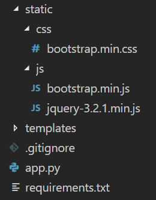

##  Goals

- [ ] Render HTML templates
- [ ] Pass variables from URL routes
- [ ] Style pages using Jinja

## Getting Started

Open the portfolio project directory that you created last time.

1. Create a new folder named `templates`.

```shell
mkdir templates
```

This is where we'll place all of the HTML templates that we'll create later on.

2. Create a new folder named `static` with subfolders named `css` and `js`.

```shell
mkdir static
cd static
mkdir css
mkdir js
cd ..
```

This is where we'll place all of our CSS and JS files.

Your project directory should now contain the following:



3. Create a file named `about.html` and place it inside the templates folder.

```shell
<h1>Welcome to the About page.</h1>
```

4. Open `app.py` and render `about.html` inside your `about` function by replacing the return string `About` with `render_template(file_name)`.

```shell
from flask import render_template

@app.route("/about/")
def about():
	return render_template("about.html")
```

If you try to access `<URL>/about/`, the contents of `about.html` will be displayed.

*You may remove your `about_location()` function since we won't be using it anymore.*

5. Create a file named `layout.html` and place it inside the templates folder.

```shell
<!DOCTYPE html>

<html>
	<head>
		<meta charset="utf-8">
        <meta name="viewport" content="width=device-width, initial-scale=1, shrink-to-fit=no">
	</head>

	<body></body>
</html>
```

6. Check out the following links and save them inside your `static` folder:

* [jquery-3.3.1.min.js](https://code.jquery.com/jquery-3.3.1.min.js)
* [bootstrap.min.js](https://maxcdn.bootstrapcdn.com/bootstrap/3.3.7/js/bootstrap.min.js)
* [bootstrap.min.css](https://maxcdn.bootstrapcdn.com/bootstrap/3.3.7/css/bootstrap.min.css)

7. Inside the head tag of your `layout.html`, add a `title` and reference your CSS files.

```shell
<title>Your Name</title>
<link href="{{ url_for('static', filename='css/bootstrap.min.css') }}" rel="stylesheet">
```

The `url_for()` function is used to get the relative path of a file.

8. Reference your JS files inside the body tag.

```shell
<script src="{{ url_for('static', filename='js/jquery-3.3.1.min.js') }}"></script>
<script src="{{ url_for('static', filename='js/bootstrap.min.js') }}"></script>
```

9. Add a navigation bar inside the body tag as well. Make sure that the JS references are located at the bottom most part of the body.

```shell
<nav class="navbar navbar-inverse">
	<div class="container-fluid">
		<div class="navbar-header">
			<a class="navbar-brand" href="{{ url_for('home') }}">Your Name</a>
		</div>
		<ul class="nav navbar-nav">
			<li><a href="{{ url_for('about') }}">About</a></li>
			<li><a href="{{ url_for('skills') }}">Skills</a></li>
			<li><a href="{{ url_for('projects') }}">Projects</a></li>
			<li><a href="{{ url_for('contact') }}">Contact</a></li>
		</ul>
	</div>
</nav>
```

The `url_for()` function can also be used to get the relative path and URL route of the functions in your `app.py`. In this case, `url_for('about')` refers to `<URL>/about/`.

10. Add a block named `body` below the navigation bar.

```shell

```

Blocks are used to load dynamic content on a static page.

11. Go back to your `app.py`. Add an optional string input `username` to the `skills` function and set the default value to `None`.

```shell
@app.route("/skills/", defaults={'username': None})
@app.route("/skills/<string:username>/")
def skills():
	return "Skills"
```

12. Allow the `skills` function to accept the `username` variable and replace the return string with a rendered `skills.html` template that accepts the variable `username`.

```shell
@app.route("/skills/", defaults={'username': None})
@app.route("/skills/<string:username>/")
def skills(username):
	return render_template("skills.html", username=username)
```

A variable can be passed to a template by referencing it as a second parameter of the `render_template()` function.

*You may remove your `skills_toeic()` function since we won't be using it anymore.*

13. Since we don't have `skills.html` yet, create it and place it inside the `templates` folder.

```shell
<h1>Welcome to the Skills page.</h1>
```

14. To utilize the `layout.html` that we made earlier, extend it inside your `skills.html` and put your welcome header inside the `body` block.

```shell




<h1>Welcome to the Skills page.</h1>


```

Contents added in between the block tags are loaded with the layout page specified. If you try to access `<URL>/skills/`, the contents of `layout.html` and `skills.html` will be displayed.

15. To use the variable `username` inside `skills.html`, encase the variable name inside double curly braces.

```shell
<p>
	Hi, {{username|title}}! 
</p>
```

Use the `title` keyword to make the first letter of each word capitalized.

16. What happens when the value of `username` is `None`? Use an if-else statement with Jinja to handle this problem.

```shell
<p>

	Hi, stranger. What\'s your name?

	Hi, {{username|title}}! 

</p>
```

If you try to access `<URL>/skills/` without an input, it will now display the message:

> Hi, stranger. What's your name?

17. Go back to your `app.py`. Remove the optional integer input `amount` from the URL routes of `projects` function and render `projects.html` instead.

```shell
@app.route("/projects/")
def projects():
	return render_template("projects.html")
```

18. Inside the `projects` function, define a list of projects inside the variable `projects`.

```shell
projects = ["Facebook", "Twitter", "Instagram", "Uber", "Grab"]
```

19. Import `randint()` from `random` and use it to assign a random integer to a variable named `randNo`.

Add this to the top part of your code:

```shell
from random import randint
```

Add this inside `projects` function:

```shell
randNo = randint(0, len(projects) - 1)
```

The first parameter of `randint()` refers to the lowest possible number while the second parameter refers to the highest possible number, which is equal to the number of projects minus 1 since we started counting from 0.

20. Create a variable named `project` which contains a random project from the list of projects and pass all the variables to `projects.html`.

```shell
project = projects[randNo]

return render_template("projects.html", **locals())
```

The `**locals` keyword is used to pass multiple variables.

21. Create `projects.html` inside the static folder with the same structure as `skills.html`.

```shell




<h1>Welcome to the Projects page.</h1>


```

22. Finally, use the variables that we created earlier inside the `projects` function while utilizing the for loop statement.

```shell
<h3> These are what I\'ve done so far:</h3>
<ul>

	<li>{{ p }}</li>

</ul>

<p>... and <b>{{ project }}</b> is the one that I enjoyed coding the most.</p>
```

This displays a bulleted list of projects and the randomly selected project as follows:

> **There are what I've done so far:**
> * Facebook
> * Twitter
> * Instagram
> * Uber
> * Grab
>
> ... and **Facebook** is the one that I enjoyed coding the most.

## Congratulations!

You're halfway through the entire tutorial. Now try to create a template for all of your existing pages and feel free to customize them and their contents!

### Getting crazy? Need help?
If you have questions, please feel free to ask and participate on our [Gitter group](https://gitter.im/WWCodeManila/Python).