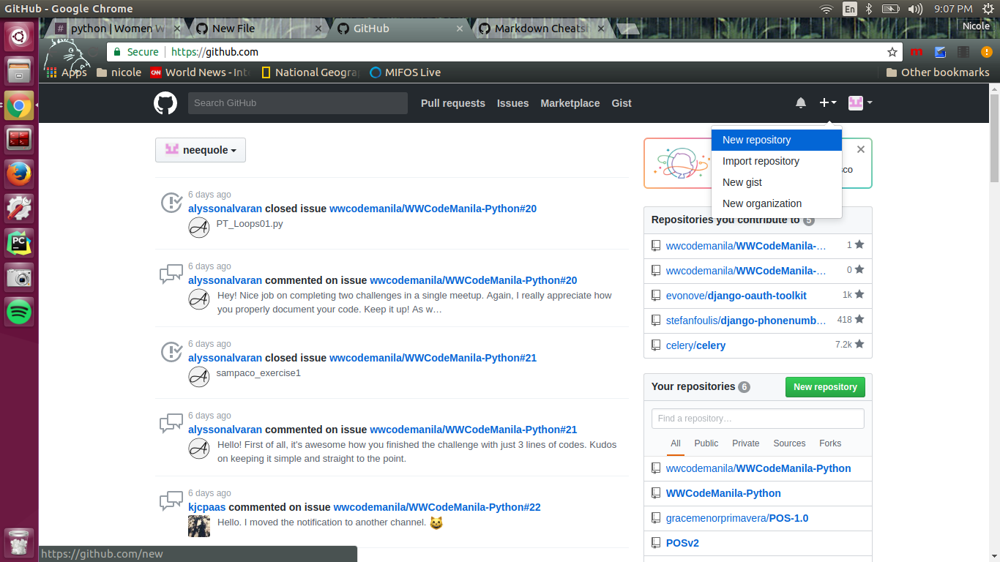
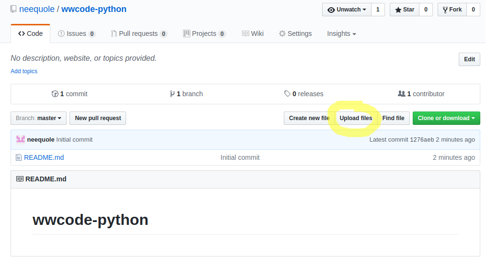

### How to share your work

> Github will allow you to easily share your code to us or to your peers.

1. [Create a Github account](https://github.com/join) if none yet, or sign in.

2. Create `wwcode-python` repository if none yet.
  *  In the toolbar(upper right of your screen), select `create new` (plus sign) -> `New Repository`
  
  
  
  *  Name your repository `wwcode-python`. Select `Public` and `Initalize this repository with a README`
  
  

3. To upload your files:  
  *  Click the `Upload files`
  
  
  
  *  Upload your work. Write a brief description of it and click `Commit changes`!
  
  
  
4. Copy the path of your work.

  

5. [Open an issue](https://github.com/wwcodemanila/WWCodeManila-Python/issues/new) in our repository with title `<Your name> - <topic>`. For example, `John Doe - Loops`.

6. Paste the path of work in the `comment` section and select `Submit new issue`.
