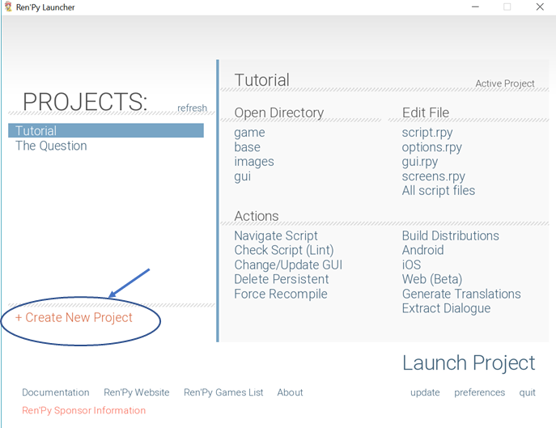
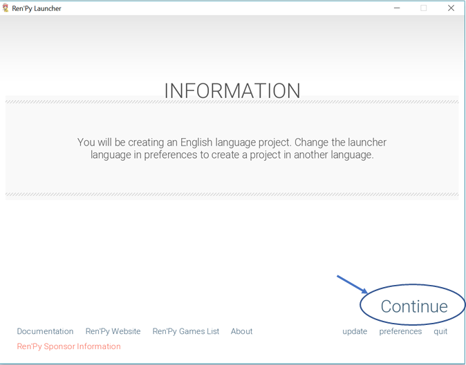
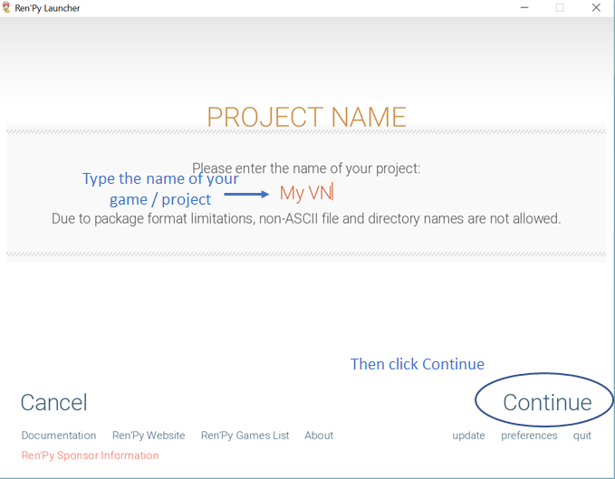
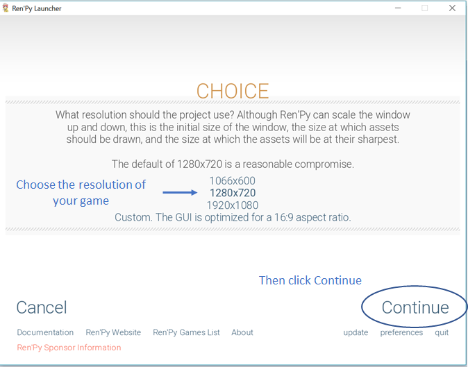
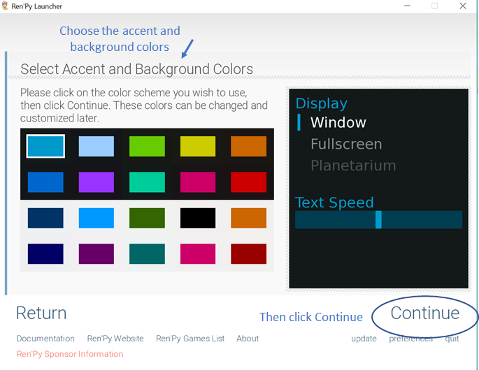
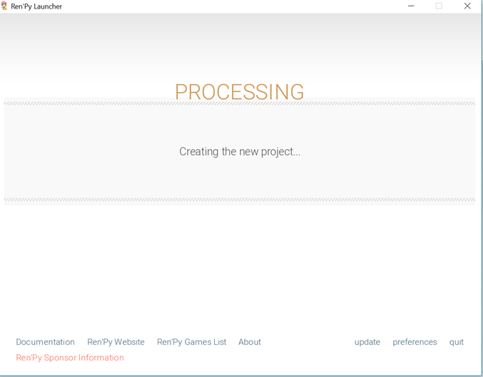
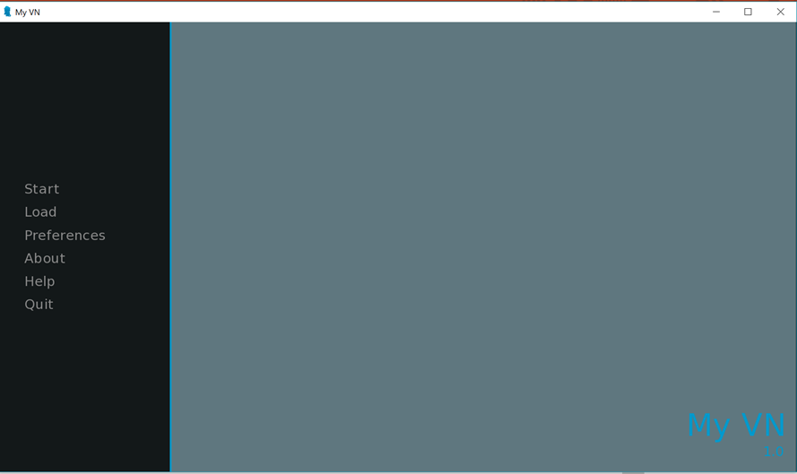
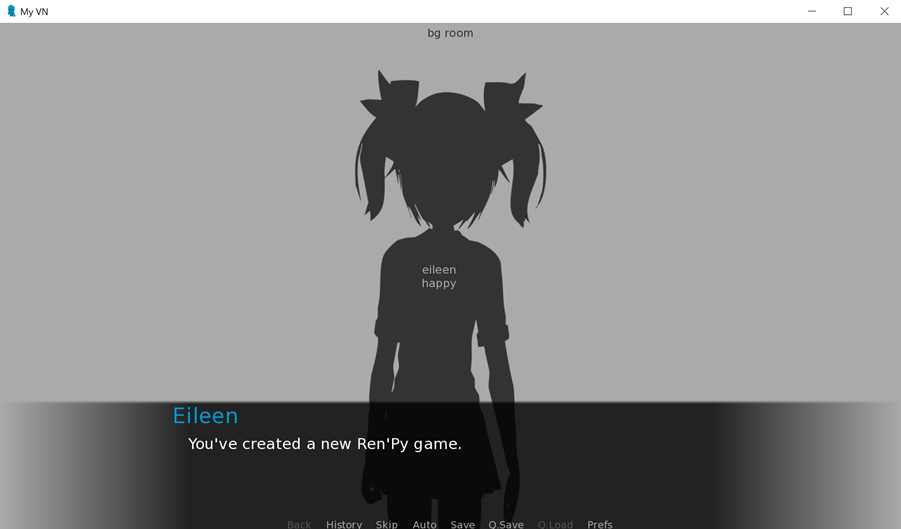

The Ren'Py software development kit already provides features such as saving, loading, and adjusting the preferences in a game. When you create a new game, you'll already have access to a game menu interface! All you really need to focus on is on creating the game itself. 

# Creating a new game

1. In the Ren'Py engine, click `+ Create New Project` . 

   

2. The default language settings is in English. If you're going to use another language, go to to `Preferences` and choose the appropriate language. Otherwise, click `Continue`  at the next prompt.

   

3. Next, you'll need to input the *Project Name*, then click `Continue`.

   

4. In the next window, you'll have to specify the *resolution of your game*. Whatever resolution you choose, make sure to fit your assets (backgrounds, character images, and other game images) in this size. Then, click `Continue`.

   

5. Choose the *accent and background colors*. You can change these later on in the scripts. Then, click `Continue`.

   

6. It will take a few seconds to setup the game environments.

   

7. Once done, you'll be able to see the Project Name you specified in the main menu of the Ren'Py engine.   Ren'Py has preloaded some of the scripts with the default codes and values. Under `Edit File`, click `All script files` to see all of these scripts in your code editor, or click `Launch Project` to see the default game interface. 

   

The default game interface will look like this:

 

# Exercise

In order to go ahead with the next parts of this study guide, first create a new Ren'Py game from the launcher. Set the title to `Aling Nena VN` or whatever title you want to put in. Make sure you set the screen size to 1980 px by 720 px. 

Next, we'll know more about the plot of Aling Nena's visual novel.

